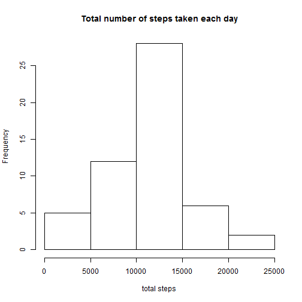
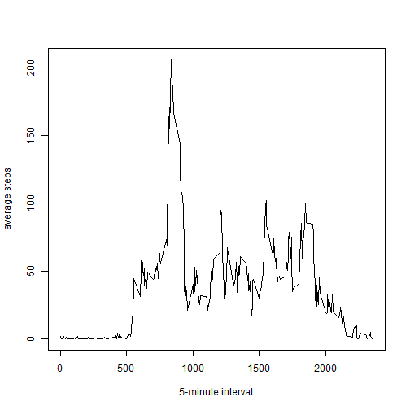
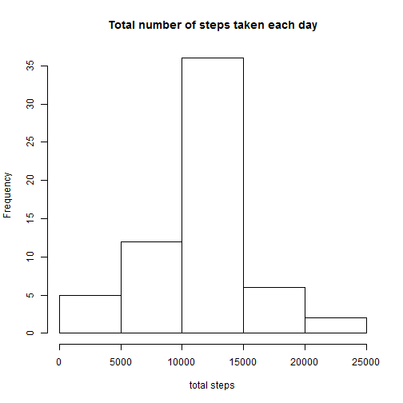
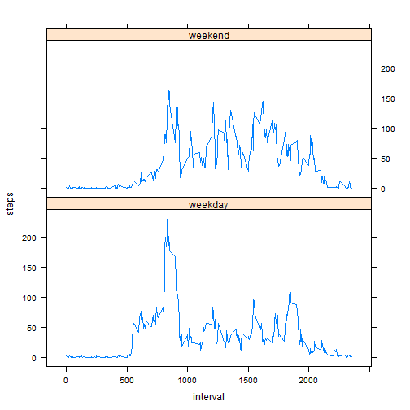

## Loading library and data


```r
    library(dplyr)
```

```r
     unzip("activity.zip")
     data <- read.csv("activity.csv")
```

## What is mean total number of steps taken per day?

###Group the data by date

```r
     data1<-data[!is.na(data$steps),]  
     data1<-group_by(data1,date)  
     totalsteps<-summarize(data1, steps=sum(steps))
```

###Histogram of the total number of steps taken each day

```r
     hist(totalsteps$steps, xlab = "total steps", main="Total number of steps taken each day")  
```

 

###The mean total number of steps taken per day

```r
    mean(totalsteps$steps)
```

```
## [1] 10766.19
```
   
###The median total number of steps taken per day

```r
   median(totalsteps$steps)
```

```
## [1] 10765
```

## What is the average daily activity pattern?

###Group the data by interval

```r
     data2<-data[!is.na(data$steps),]  
     data2 <- group_by(data2,interval)  
     invlstep <- summarize(data2, steps = mean(steps))
```

###A time series plot of the 5-minute interval and the average number of steps taken, averaged across all days. 

```r
     plot(invlstep$steps~invlstep$interval, type="l", xlab= "5-minute interval", ylab = "average steps")
```

 

###The interval that contains the maximum number of steps

```r
 invlstep$interval[which.max(invlstep$steps)]
```

```
## [1] 835
```

## Inputing missing values
###Total number of missing values in the dataset

```r
     sum(is.na(data$steps))
```

```
## [1] 2304
```
###Strategy for filling in the missing values
 
    The missing values are replaced by the mean for the 5-minute interval.
###New dataset with missing values filled in


```r
     data3 <- data   #replicate the data
     num_itl <- data3[is.na(data3$steps),]$interval      #the corresponding interval for each NA 
     idx_itl <- vector()
     for( i in 1:2304){
       idx_itl[i] <- which(invlstep$interval==  num_itl[i])
     }     #the corresponding index for the interval in the group data set invlstep 
     data3[is.na(data3$steps),]$steps <- invlstep$steps[idx_itl] #replace the NA with mean of that interval
```
###Histogram of the total number of steps taken each day 

```r
     data4<-group_by(data3,date)  
     totalsteps2<-summarize(data4, steps=sum(steps))
```


```r
     hist(totalsteps2$steps, xlab = "total steps", main="Total number of steps taken each day")
```

 

###The mean total number of steps taken per day

```r
     mean(totalsteps2$steps)
```

```
## [1] 10766.19
```

###The median total number of steps taken per day

```r
     median(totalsteps2$steps)
```

```
## [1] 10766.19
```

The mean is the same as the estimates from the first part. The medium number shows a slightly change. 
Because the NA are replaced with the mean, the mean number is not affected, the mean and medium get closer.


## Are there differences in activity patterns between weekdays and weekends?

###Create a new factor variable in the dataset with two levels - "weekday" and "weekend" 

```r
     data5<- data3
     data5$day <-factor(weekdays(as.Date(data3$date)))
     levels(data5$day) <- list(weekday = c("Monday", "Tuesday", "Wednesday", 
                           "Thursday", "Friday"), weekend = c("Saturday", "Sunday"))
```


```r
     data5<-group_by(data5,day, interval)  
     data5<-summarize(data5, steps=mean(steps))
```

###A panel plot containing a time series plot of the 5-minute interval and the average number of steps taken

```r
    library(lattice)
    xyplot(steps ~ interval | factor(day), data = data5,layout = c(1, 2),type = "l")
```

 
